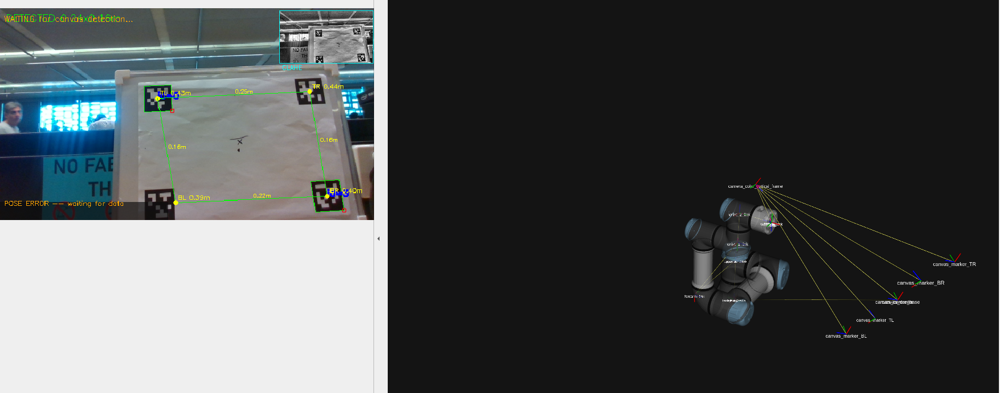
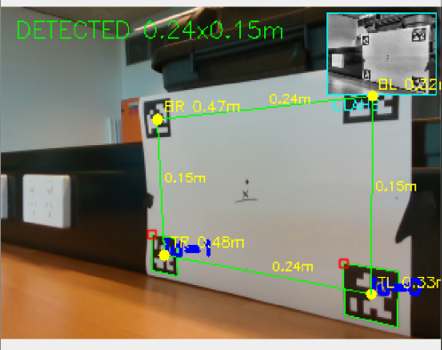
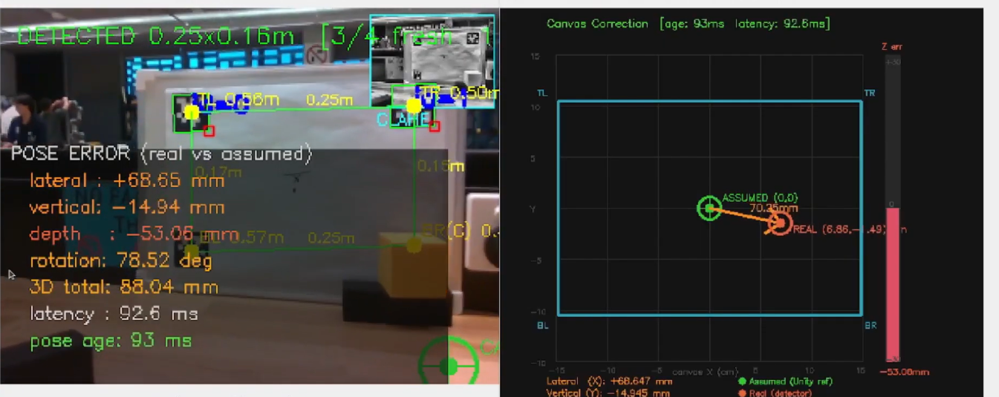
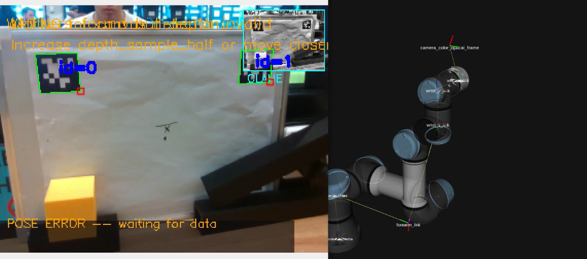
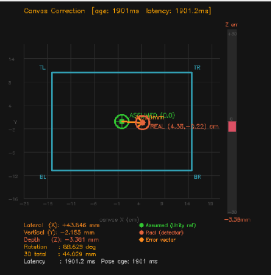
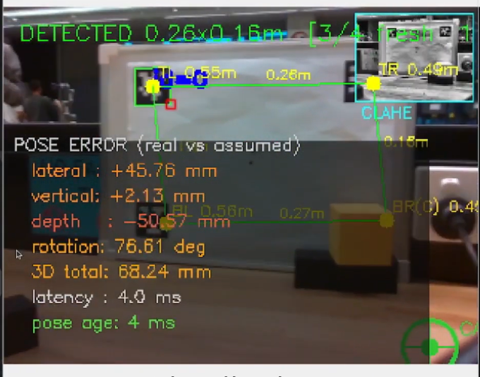
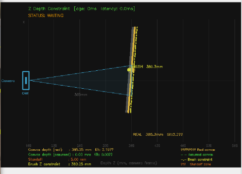
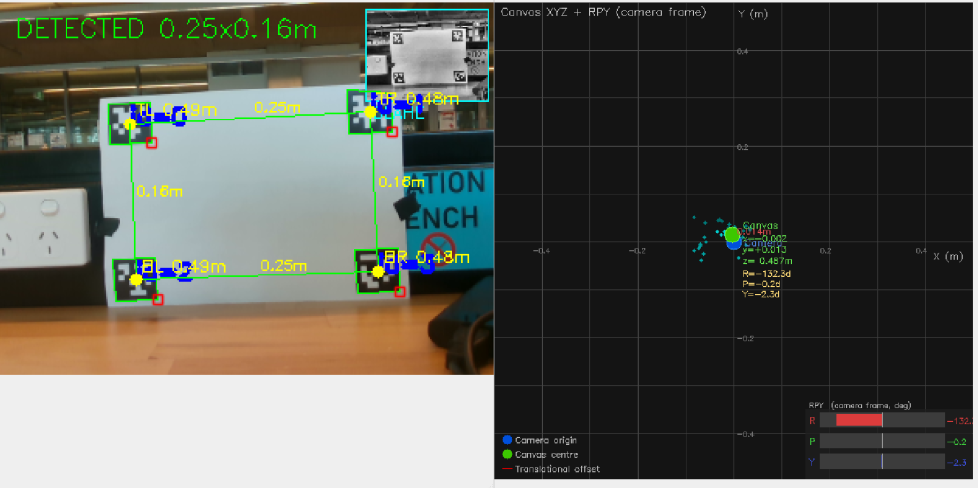
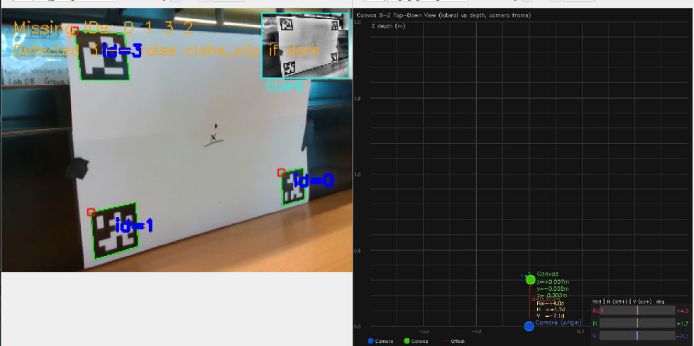
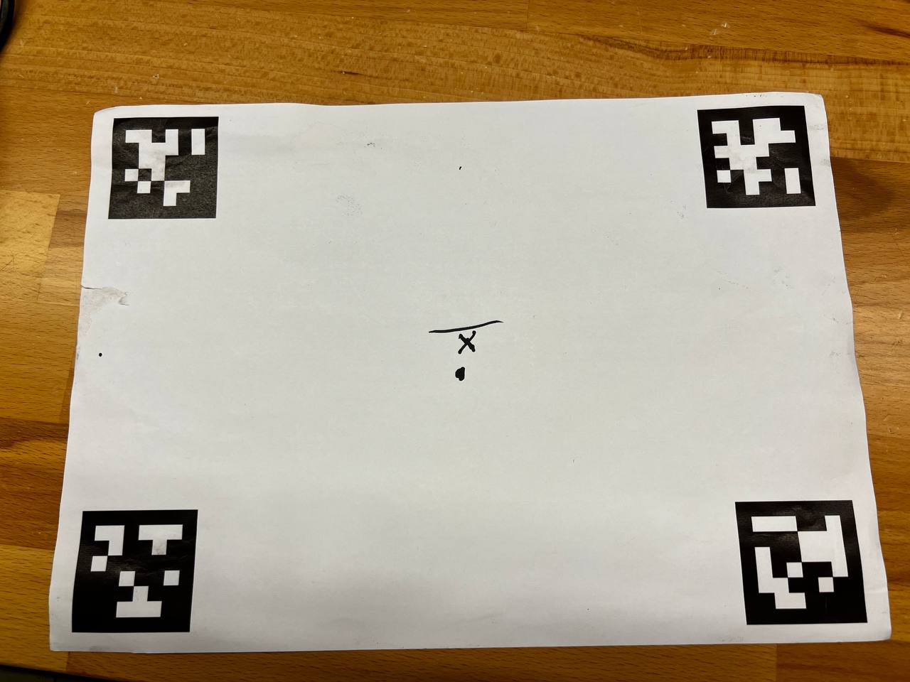

# Subsystem: Canvas Pose Detector (Camera Perception)

**Package:** `canvas_pose_detector`
**Build type:** `ament_cmake` (C++ detection node + 7 Python nodes)
**Version:** 0.13.0

## Purpose

Detects an A4 canvas in 3D space using a wrist-mounted Intel RealSense D435if depth camera and AprilTag 36h11 corner markers. Publishes the canvas 6-DOF pose, SE3 drift correction, and a brush Z-depth constraint that MoveIt Servo uses to keep the brush on the canvas surface.

This subsystem is the **perception backbone** of the teleoperation system -- without it, the robot has no knowledge of where the canvas is.

<!-- TODO: Replace with a screenshot of the full pipeline running (rqt_image_view showing /canvas/debug) -->


---

## Package Layout

```
canvas_pose_detector/
├── launch/
│   ├── canvas_real_pipeline.launch.py      # Full pipeline with real camera (production)
│   ├── canvas_sim_pipeline.launch.py       # Camera-free simulation (no hardware)
│   ├── canvas_visualise_all.launch.py      # RViz + all rqt image views
│   ├── canvas_pose_detector.launch.py      # Detector node only
│   ├── canvas_pose_injector.launch.py      # Synthetic pose publisher only
│   ├── canvas_tf_bridge.launch.py          # TF bridge + corrector
│   ├── canvas_stroke_corrector.launch.py   # Corrector only
│   ├── canvas_tf_bridge_validation.launch.py
│   └── canvas_pose_validation.launch.py    # Legacy
├── src/
│   ├── canvas_pose_detector.cpp            # C++ AprilTag detection (1347 lines)
│   ├── canvas_tf_bridge.py                 # PoseStamped frame transformer
│   ├── canvas_stroke_corrector.py          # SE3 error correction + Z constraint
│   ├── canvas_correction_visualiser.py     # Camera overlay + 2D error plot
│   ├── canvas_depth_visualiser.py          # XZ side-view depth visualiser
│   ├── canvas_pose_visualiser.py           # 2D/3D pose plots
│   ├── canvas_pose_injector.py             # Synthetic pose publisher (sim mode)
├── config/
│   ├── rviz_full.rviz
│   └── rviz_tf_validation.rviz
├── CMakeLists.txt
└── package.xml
```

---

## Pipeline Architecture

The perception subsystem is a **4-stage pipeline** where each node does one job and passes data downstream:

```
                          ┌──────────────────────────────────────────┐
                          │        Intel RealSense D435if            │
                          │     (wrist-mounted depth camera)         │
                          └────────────────┬─────────────────────────┘
                                           │
               /camera/camera/color/image_raw (RGB)
               /camera/camera/aligned_depth_to_color/image_raw (16-bit depth)
               /camera/camera/color/camera_info (intrinsics)
                                           │
                                           v
               ┌───────────────────────────────────────────────────┐
  Stage 1      │         canvas_pose_detector  (C++, ~18 fps)     │
  DETECTION    │  AprilTag detection -> 6-DOF canvas pose          │
               └───────────────────────────┬───────────────────────┘
                                           │
               /canvas/pose          PoseStamped (camera_color_optical_frame)
               /canvas/viewing_angles Vector3Stamped (Roll/H/V degrees)
               /canvas/markers       MarkerArray (RViz visualisation)
               /canvas/debug         Image (annotated camera feed)
               TF: canvas_centre, canvas_marker_TL/TR/BR/BL
                                           │
                                           v
               ┌───────────────────────────────────────────────────┐
  Stage 2      │              canvas_tf_bridge  (Python)           │
  TRANSFORM    │  camera frame -> base_link via TF tree            │
               └───────────────────────────┬───────────────────────┘
                                           │
               /canvas/pose_base     PoseStamped (base_link)       <- primary output
               /canvas/pose_tool0    PoseStamped (tool0)           <- verification
               TF: canvas_centre_base
                                           │
                                           v
               ┌───────────────────────────────────────────────────┐
  Stage 3      │         canvas_stroke_corrector  (Python, 50 Hz) │
  CORRECTION   │  Latch reference -> compute SE3 error -> Z output │
               └───────────────────────────┬───────────────────────┘
                                           │
               /canvas/z_constraint   PoseStamped (base_link)      -> MoveIt Servo
               /canvas/pose_error     PoseStamped (canvas_centre_assumed)
               /canvas/pose_assumed   PoseStamped (latched reference)
               /canvas/correction_data String (JSON status + errors)
               TF: canvas_centre_assumed
                                           │
                                           v
               ┌───────────────────────────────────────────────────┐
  Stage 4      │            Visualiser nodes  (Python)             │
  VISUALISE    │  correction_visualiser, depth_visualiser,         │
               │  pose_visualiser                                  │
               └───────────────────────────────────────────────────┘
                                           │
               /canvas/correction_2d   Image (top-down error plot)
               /canvas/debug_corrected Image (camera overlay + drift arrow)
               /canvas/depth_view      Image (XZ side-view depth)
               /canvas/pose_2d_xy      Image (X vs Y lateral plot)
               /canvas/pose_2d_xz      Image (X vs Z bird's eye)
               /canvas/pose_3d_tf      Image (3D TF frame view)
```

For **camera-free simulation**, `canvas_pose_injector` replaces Stage 1 and publishes identical topics to `/canvas/pose`, so the rest of the pipeline works unchanged.

---

## Nodes (Detailed)

### 1. `canvas_pose_detector` (C++ -- `src/canvas_pose_detector.cpp`)

The core detection node. Runs at **~18 fps** on a standard desktop.

#### What it does (step by step)

1. **Receives** synchronised colour + depth + camera_info via `message_filters::ApproximateTimeSynchronizer`
2. **Enhances** the grayscale image with CLAHE (Contrast Limited Adaptive Histogram Equalization) to handle varying lighting
3. **Detects** AprilTag 36h11 markers using OpenCV's `cv::aruco::detectMarkers` with configurable adaptive threshold passes
4. **Maps** detected 2D marker corners to known canvas corner positions (IDs 0-3 = TL, TR, BR, BL)
5. **Recovers** missing markers using partial detection (see algorithm below)
6. **Samples** depth for each corner from the aligned depth image (median over a radius)
7. **Back-projects** 2D corners + depth to 3D points using camera intrinsics (`fx, fy, cx, cy`)
8. **Computes** the 6-DOF canvas centre pose using `cv::solvePnP` (IPPE_SQUARE method)
9. **Broadcasts** TF frames for the canvas centre and all four corners
10. **Publishes** the pose, viewing angles, RViz markers, and an annotated debug image

#### Subscribed Topics

| Topic | Type | Description |
|---|---|---|
| `/camera/camera/color/image_raw` | `sensor_msgs/Image` | RGB camera feed |
| `/camera/camera/aligned_depth_to_color/image_raw` | `sensor_msgs/Image` | Aligned 16-bit depth map |
| `/camera/camera/color/camera_info` | `sensor_msgs/CameraInfo` | Camera intrinsics (fx, fy, cx, cy) |

#### Published Topics

| Topic | Type | Rate | Description |
|---|---|---|---|
| `/canvas/pose` | `geometry_msgs/PoseStamped` | ~18 Hz | 6-DOF canvas centre in `camera_color_optical_frame` |
| `/canvas/viewing_angles` | `geometry_msgs/Vector3Stamped` | ~18 Hz | x=Roll, y=Horizontal, z=Vertical (degrees) |
| `/canvas/markers` | `visualization_msgs/MarkerArray` | ~18 Hz | RViz: plane, corners, RPY arcs, XYZ axes, label |
| `/canvas/debug` | `sensor_msgs/Image` | 10 Hz | Annotated camera feed with marker overlays |

#### TF Frames Broadcast

| Frame | Parent | Description |
|---|---|---|
| `canvas_centre` | `camera_color_optical_frame` | Canvas centre |
| `canvas_marker_TL` | `camera_color_optical_frame` | Top-left marker (ID 0) |
| `canvas_marker_TR` | `camera_color_optical_frame` | Top-right marker (ID 1) |
| `canvas_marker_BR` | `camera_color_optical_frame` | Bottom-right marker (ID 2) |
| `canvas_marker_BL` | `camera_color_optical_frame` | Bottom-left marker (ID 3) |

#### Parameters

| Parameter | Default | Live-Tunable | Description |
|---|---|---|---|
| `aruco_win_max` | 23 | Yes | ArUco adaptive threshold max window. **Primary speed/accuracy knob.** 23 = fast (~18 fps, 3 passes), 53 = balanced (~10 fps, 6 passes), 83 = robust (~5 fps, 9 passes) |
| `aruco_win_step` | 10 | Yes | Window size step between passes |
| `aruco_win_min` | 3 | Yes | Minimum window size |
| `clahe_clip` | 4.0 | Yes | CLAHE contrast limit. Raise to **6.0-8.0** for dark/shadowed environments |
| `clahe_tile` | 8 | Yes | CLAHE tile grid size |
| `marker_size_m` | 0.050 | No | Printed AprilTag physical size in metres |
| `canvas_physical_w_m` | 0.297 | No | A4 landscape width (m) |
| `canvas_physical_h_m` | 0.210 | No | A4 landscape height (m) |
| `missing_frames_tol` | 5 | No | Frames a marker can be absent before triggering reconstruction |
| `last_known_tol` | 300 | No | Frames a cached 3D position is trusted (~15s at 20 fps). Handles wrist occlusion |
| `depth_sample_half` | 12 | No | Depth sampling radius in pixels (median filter) |
| `max_depth_m` | 3.0 | No | Maximum valid depth reading (m) |
| `publish_debug` | true | No | Publish annotated debug image |
| `debug_scale` | 0.5 | No | Debug image scale factor |
| `debug_fps` | 10.0 | No | Debug image publish rate cap (Hz) |
| `rpy_offset_roll` | 133.0 | Yes | Roll display offset (degrees). Display only, not applied to pose output |
| `rpy_offset_yaw` | -176.8 | Yes | Yaw display offset (degrees). Display only |
| `aruco_error_rate` | 0.6 | No | ArUco error correction rate |
| `sync_queue_size` | 30 | No | Message filter sync queue depth |
| `marker_id_tl/tr/br/bl` | 0/1/2/3 | No | AprilTag IDs for each corner |

#### Key Algorithms

**Partial Detection Recovery**

The detector does not require all 4 markers to be visible:

| Markers Visible | Method | Accuracy |
|---|---|---|
| 4 | Normal full detection | Best |
| 3 | Parallelogram rule: missing = opposite_pair_sum - adjacent (exact for rectangles since TL+BR = TR+BL) | Exact |
| 2 adjacent | A4 aspect ratio: rotate the detected edge 90 degrees and scale by H/W ratio to reconstruct the perpendicular edge | Good |
| 2 diagonal | A4 diagonal angle: the diagonal makes a fixed angle `atan2(H,W) = 35.2°` with the horizontal edge. Since marker IDs identify which diagonal (TL-BR vs TR-BL), the edge direction is recovered uniquely with no reflection ambiguity | Good |
| 1 | solvePnP on single marker: uses the 4 image corners of the one visible AprilTag + known `marker_size_m` to estimate the marker's 6-DOF pose via `cv::solvePnP(IPPE_SQUARE)`. The remaining 3 canvas corners are computed using known canvas dimensions (`canvas_physical_w_m` x `canvas_physical_h_m`) in the marker's local frame, then projected back to 2D via `cv::projectPoints`. | Approximate |
| 0 | Rejected | N/A |

Markers missing for fewer than `missing_frames_tol` (default 5) frames are held at their last known position before reconstruction is attempted.

**Debug visualisation for reconstructed corners:**

In the `/canvas/debug` image, reconstructed corner positions (from 1- or 2-marker recovery) are shown with:
- **Magenta dots** (vs cyan for freshly detected, orange for cached)
- **Dashed orange bounding boxes** around the reconstructed position
- **"(R)" label suffix** next to the corner ID

<!-- TODO: Insert screenshots showing partial detection cases -->
| 4 markers detected | 3 markers (1 occluded) | 2 markers | 1 marker |
|---|---|---|---|
|  |  |  |  |

**3D Position Caching (v14)**

When a marker is occluded (e.g., by the robot wrist at close range), the system uses a priority cascade:

1. Fresh depth sample (marker detected this frame)
2. Persistence buffer depth (within `missing_frames_tol` frames)
3. **3D cache** (within `last_known_tol` frames, ~15s) -- avoids re-projecting to 2D and re-sampling depth
4. 2D reconstruction + depth sample (final fallback)

**Viewing Angles**

Computed geometrically from depth-measured canvas normal via **cross product of edge vectors**, NOT from solvePnP quaternion RPY decomposition. This avoids a 35-degree pitch reading as 4 degrees due to Euler angle axis coupling.

```
h_edge = TR_3d - TL_3d          (horizontal edge vector)
v_edge = BL_3d - TL_3d          (vertical edge vector)
normal = normalise(h_edge x v_edge)

Roll = atan2(h_edge.y, h_edge.x)     (in-plane rotation)
H    = atan2(normal.x, -normal.z)    (horizontal tilt)
V    = atan2(-normal.y, -normal.z)   (vertical tilt)
```

**Depth Sampling**

For each marker corner, depth is sampled as the **median** of valid pixels within a `2 * depth_sample_half` pixel radius. This rejects outliers and fills minor depth holes.

---

### 2. `canvas_tf_bridge` (Python -- `src/canvas_tf_bridge.py`)

**Purpose:** Transforms `/canvas/pose` from `camera_color_optical_frame` to `base_link` using the TF tree. This is the link between the camera's local coordinate system and the robot's world frame.

**Why it exists:** The detector publishes in the camera frame (that's all it knows about). To send commands to the robot, the canvas pose needs to be in `base_link`. The TF tree chain is:

```
base_link -> shoulder_link -> ... -> flange -> camera_color_optical_frame -> canvas_centre
```

The `flange -> camera_color_optical_frame` link is a static TF published by the launch file (hand-eye calibration values). The rest comes from the UR driver.

#### Subscribed / Published Topics

| Direction | Topic | Type | Description |
|---|---|---|---|
| Subscribe | `/canvas/pose` (configurable) | PoseStamped | Input in camera frame |
| Publish | `/canvas/pose_base` | PoseStamped | Canvas pose in `base_link` (primary) |
| Publish | `/canvas/pose_tool0` | PoseStamped | Canvas pose in `tool0` (verification) |
| TF Broadcast | `canvas_centre_base` | -- | Canvas centre in `base_link` |

#### Parameters

| Parameter | Default | Description |
|---|---|---|
| `source_topic` | `/canvas/pose` | Input PoseStamped topic |
| `target_frame` | `base_link` | Primary output frame |
| `output_topic` | `/canvas/pose_base` | Primary output topic |
| `secondary_frame` | `tool0` | Secondary verification frame |
| `secondary_topic` | `/canvas/pose_tool0` | Secondary output topic |
| `broadcast_tf` | true | Whether to broadcast the TF frame |
| `tf_child_frame` | `canvas_centre_base` | Name of the broadcast TF child |
| `tf_timeout_s` | 0.10 | TF lookup timeout (s) |

**Design:** Fully frame-agnostic -- reads `frame_id` from incoming messages. Uses `MultiThreadedExecutor` (2 threads). All parameters live-tunable without restart. Throttled TF failure warnings (3s between logs).

---

### 3. `canvas_stroke_corrector` (Python -- `src/canvas_stroke_corrector.py`)

**Purpose:** Establishes a stable reference pose (T_assumed) and continuously measures how far the real canvas has drifted from it. Outputs a brush Z-constraint for the robot.

This is the key node for **precision**: even if the canvas moves slightly after setup, the corrector tracks the drift and adjusts the output.

#### How it works

```
1. WAITING:     No poses received yet. Output frozen.
2. COLLECTING:  Receiving poses. Collecting N frames over latch_window_s (default 10s).
                Canvas must be STILL during this window.
3. OK:          Reference latched. Publishing live SE3 error + Z constraint at 50 Hz.
4. PAUSED:      No new pose for > pose_timeout_s (default 5s). Output frozen at last known.
```

**Latching algorithm:**
- Collects all poses during the window
- Averages translations (arithmetic mean)
- Averages quaternions using the **eigenvector method (Markley 2007)** -- handles quaternion sign ambiguity correctly (unlike naive element-wise averaging)
- Freezes the result as T_assumed

**SE3 error computation:**

```
T_real    = live canvas pose (from detector)
T_assumed = latched reference pose (frozen after collection)

R_err = R_assumed^T * R_real
t_err = R_assumed^T * (t_real - t_assumed)

Result (in canvas_centre_assumed frame):
  t_err.x = lateral error   (right = +)   metres
  t_err.y = vertical error  (up = +)      metres
  t_err.z = depth error     (toward camera = +)  metres
  rotation_deg = angle from R_err
```

This is a proper SE3 inverse composition, not naive position subtraction. The error is expressed in the **canvas frame**, so lateral/vertical/depth are always meaningful regardless of how the canvas is oriented in the world.

#### Subscribed / Published Topics

| Direction | Topic | Type | Description |
|---|---|---|---|
| Subscribe | `/canvas/pose` (configurable) | PoseStamped | Live canvas pose |
| Subscribe | `/canvas/pose_assumed` | PoseStamped | External override for reference (optional) |
| Publish | **`/canvas/z_constraint`** | PoseStamped | **Primary output for MoveIt Servo** |
| Publish | `/canvas/pose_error` | PoseStamped | SE3 error in assumed frame |
| Publish | `/canvas/pose_assumed` | PoseStamped | Latched reference pose |
| Publish | `/canvas/correction_data` | String (JSON) | Status + all error values |
| TF Broadcast | `canvas_centre_assumed` | -- | Latched reference frame |

#### `/canvas/z_constraint` -- The Interface to MoveIt Servo

This is the **primary output** consumed by the robot control subsystem:

```
frame_id:       base_link
position.x/y:   live canvas centre lateral position in base_link
position.z:     canvas surface depth MINUS brush_standoff_m  (brush tip Z)
orientation:    canvas face normal quaternion (tool must stay perpendicular)
```

MoveIt Servo locks the end-effector Z to `msg.pose.position.z` while allowing XY freedom for drawing strokes. The orientation keeps the brush perpendicular to the canvas face.

#### `/canvas/correction_data` -- JSON Status

```json
{
  "status": "OK",
  "pose_age_ms": 35.0,
  "latency_ms": 3.7,
  "remaining_s": 0.0,
  "error": {
    "lateral_mm": -2.1,
    "vertical_mm": 1.4,
    "depth_mm": -0.8,
    "rotation_deg": 0.3,
    "total_3d_mm": 2.6
  }
}
```

This JSON is consumed by Unity to show the canvas status in VR (see [Unity Integration Guide](Unity-Integration-Guide.md)).

#### Parameters

| Parameter | Default | Live-Tunable | Description |
|---|---|---|---|
| `source_topic` | `/canvas/pose_base` | No | Input topic (must match bridge output in real pipeline, or `/canvas/pose` in sim) |
| `latch_window_s` | 10.0 | No | Collection window before latching. Longer = more stable reference, but longer setup |
| `brush_standoff_m` | 0.005 | **Yes** | Brush hover above canvas (m). 0.005 = 5mm hover, 0.0 = touching |
| `publish_rate_hz` | 50.0 | No | Output rate. Matches MoveIt Servo's expected input rate |
| `pose_timeout_s` | 5.0 | No | Max pose age before PAUSED status |
| `enabled` | true | **Yes** | `false` = freeze output without killing the node |

---

### 4. `canvas_pose_injector` (Python -- `src/canvas_pose_injector.py`)

**Purpose:** Drop-in replacement for the real detector in simulation mode. Publishes a synthetic canvas pose without requiring a camera. The rest of the pipeline does not know the difference.

**Published Topics:** Same as `canvas_pose_detector` -- `/canvas/pose`, `/canvas/viewing_angles`, `/canvas/markers`, TF `canvas_centre`, TF `canvas_marker_TL/TR/BR/BL`

**Parameters:**

| Parameter | Default | Live-Tunable | Description |
|---|---|---|---|
| `parent_frame` | `camera_color_optical_frame` | No | TF parent |
| `canvas_x/y/z` | `0.0/0.0/0.5` | **Yes** | Canvas position in parent frame (m) |
| `canvas_roll/pitch/yaw_deg` | `0.0/0.0/0.0` | **Yes** | Canvas orientation (degrees) |
| `publish_rate_hz` | 10.0 | **Yes** | Output rate |
| `animate` | false | **Yes** | Sinusoidal oscillation of one axis |
| `animate_axis` | `yaw` | **Yes** | Which axis to oscillate: `x`, `y`, `z`, `roll`, `pitch`, `yaw` |
| `animate_range` | 30.0 | **Yes** | Half-amplitude (degrees for angles, metres for position) |
| `animate_period_s` | 4.0 | **Yes** | Period of one full cycle |

**All parameters are live-tunable** via `ros2 param set`. This makes it easy to test different canvas positions and orientations without restarting anything.

---

### 5. `canvas_correction_visualiser` (Python -- `src/canvas_correction_visualiser.py`)

**Purpose:** Creates visual overlays showing the SE3 drift error. **Requires live camera feed** -- only works in the real pipeline.

| Subscribed | Published |
|---|---|
| `/canvas/pose`, `/canvas/pose_assumed` | `/canvas/correction_2d` -- top-down +/-150mm 2D error plot |
| `/canvas/correction_data` | `/canvas/debug_corrected` -- camera overlay with drift arrow |
| `/canvas/debug`, `/camera/camera/color/camera_info` | |

**Correction 2D plot:** Shows the assumed canvas origin at centre (green) and the real origin at the error offset (blue). Error arrow + depth bar + status panel. Range: +/-150mm.

**Camera overlay:** Projects assumed/real canvas centres onto the camera image. Green crosshair at assumed origin, dashed arrow to real origin. Error values overlaid.

<!-- TODO: Insert screenshots of correction visualiser outputs -->
| `/canvas/correction_2d` | `/canvas/debug_corrected` |
|---|---|
|  |  |

---

### 6. `canvas_depth_visualiser` (Python -- `src/canvas_depth_visualiser.py`)

**Purpose:** XZ side-view showing the canvas plane, assumed position, standoff zone, and brush Z constraint line. **Works without camera** (uses only pose topics).

| Subscribed | Published |
|---|---|
| `/canvas/pose`, `/canvas/pose_assumed` | `/canvas/depth_view` -- 700x480 XZ plot at 15 fps |
| `/canvas/z_constraint`, `/canvas/correction_data` | |

**Visual elements:** Camera cone at origin, cyan line for real canvas plane (angled based on tilt), green dashed line for assumed canvas, blue standoff band, yellow constraint line (where the brush Z is locked), orange depth error bracket.

<!-- TODO: Insert screenshot of depth visualiser -->


---

### 7. `canvas_pose_visualiser` (Python -- `src/canvas_pose_visualiser.py`)

**Purpose:** 2D and 3D pose plots for debugging. **Works without camera.**

| Subscribed | Published |
|---|---|
| `/canvas/pose` | `/canvas/pose_2d_xy` -- X vs Y lateral/vertical plot |
| `/canvas/viewing_angles` | `/canvas/pose_2d_xz` -- X vs Z depth/lateral bird's eye |
| | `/canvas/pose_3d_tf` -- 3D TF frame illustration with RPY arcs |

<!-- TODO: Insert screenshots of pose visualiser outputs -->
| `/canvas/pose_2d_xy` | `/canvas/pose_2d_xz` | `/canvas/pose_3d_tf` |
|---|---|---|
|  |  |  |

---

## How to Run

### Simulation (No Hardware -- Recommended for First Test)

```bash
source ~/RS2/XR_Teleoperation/install/setup.bash
ros2 launch canvas_pose_detector canvas_sim_pipeline.launch.py
```

**What happens:**
1. `canvas_pose_injector` starts publishing synthetic `/canvas/pose` at 10 Hz
2. At t=2s, `canvas_stroke_corrector` starts. Status: `COLLECTING`
3. At t=3s, visualisers start
4. At t=12s, corrector finishes collecting. Status: **`OK`** -- all outputs active

**To view visualisations:**
```bash
ros2 run rqt_image_view rqt_image_view
# Select topic from dropdown: /canvas/depth_view, /canvas/pose_2d_xy, etc.
```

**To verify topics:**
```bash
ros2 topic hz /canvas/pose                    # Expect ~10 Hz
ros2 topic echo /canvas/correction_data --once # Expect status: "OK"
ros2 node list | grep canvas                   # Should show 4 nodes
```

### With Animation (Sim)

```bash
ros2 launch canvas_pose_detector canvas_sim_pipeline.launch.py \
  animate:=true animate_axis:=yaw animate_range:=25.0 animate_period_s:=4.0
```

The synthetic canvas sweeps left/right continuously. Watch the visualisers respond in real time -- useful for demonstrating the pipeline is tracking a moving canvas.

### Real Camera Pipeline (Production)

**Terminal 1** -- RealSense driver (must be in its own terminal):
```bash
ros2 launch realsense2_camera rs_launch.py \
  enable_sync:=true align_depth.enable:=true
```

**Terminal 2** -- Perception pipeline:
```bash
ros2 launch canvas_pose_detector canvas_real_pipeline.launch.py
```

**Expected startup timeline:**

| Time | Event | Log Output |
|---|---|---|
| t=0s | Camera driver starts | RealSense LED turns on |
| t=0s | Detector starts | `[canvas_pose_detector] Waiting for synced colour+depth...` |
| t=2-4s | Markers detected | `[canvas_pose_detector] Canvas detected (4/4 markers)` |
| t=3s | TF bridge starts | `[canvas_tf_bridge] Publishing /canvas/pose_base in base_link` |
| t=4s | Corrector starts collecting | `[canvas_stroke_corrector] Status: COLLECTING (10.0s remaining)` |
| t=14s | Reference latched | `[canvas_stroke_corrector] Status: OK` |

**View output:**
```bash
ros2 run rqt_image_view rqt_image_view
# Topics to view: /canvas/debug, /canvas/correction_2d, /canvas/depth_view, /canvas/debug_corrected
```

### Individual Node Launch (Debugging)

```bash
# Detector only (requires RealSense already running)
ros2 launch canvas_pose_detector canvas_pose_detector.launch.py

# Injector only (no hardware needed)
ros2 launch canvas_pose_detector canvas_pose_injector.launch.py

# TF bridge only (requires detector/injector + robot TF tree)
ros2 launch canvas_pose_detector canvas_tf_bridge.launch.py

# Corrector only
ros2 launch canvas_pose_detector canvas_stroke_corrector.launch.py
```

### Full Visualisation Suite

```bash
# With real pipeline running:
ros2 launch canvas_pose_detector canvas_visualise_all.launch.py

# With sim pipeline running (no joint GUI needed):
ros2 launch canvas_pose_detector canvas_visualise_all.launch.py use_joint_gui:=true
```

This opens RViz (robot model + TF tree + canvas markers) and 4 `rqt_image_view` windows staggered at 0.5s intervals.

---

## Live Parameter Tuning

All key parameters can be changed at runtime **without restarting any nodes**:

```bash
# === Detection Tuning ===
# If markers fail at distance or in poor lighting:
ros2 param set /canvas_pose_detector aruco_win_max 53   # more passes, slower but more robust
ros2 param set /canvas_pose_detector clahe_clip 8.0     # boost contrast for dark scenes

# If detection is too slow (>50ms/frame):
ros2 param set /canvas_pose_detector aruco_win_max 23   # fewer passes, faster

# === Corrector Tuning ===
# Adjust brush standoff (how far above the canvas the brush hovers):
ros2 param set /canvas_stroke_corrector brush_standoff_m 0.010  # 10mm hover
ros2 param set /canvas_stroke_corrector brush_standoff_m 0.000  # touching canvas

# Pause/resume correction output:
ros2 param set /canvas_stroke_corrector enabled false  # freeze output
ros2 param set /canvas_stroke_corrector enabled true   # resume

# === Injector Tuning (sim only) ===
# Move the synthetic canvas:
ros2 param set /canvas_pose_injector canvas_z 0.7
ros2 param set /canvas_pose_injector canvas_yaw_deg 30.0

# Start/stop animation:
ros2 param set /canvas_pose_injector animate true
ros2 param set /canvas_pose_injector animate_axis yaw
ros2 param set /canvas_pose_injector animate_range 25.0
ros2 param set /canvas_pose_injector animate false   # stop
```

---

## All Topics Summary

| Topic | Type | Publisher | Consumer | Description |
|---|---|---|---|---|
| `/canvas/pose` | PoseStamped | detector / injector | tf_bridge, corrector, visualisers, Unity | 6-DOF canvas centre |
| `/canvas/viewing_angles` | Vector3Stamped | detector / injector | pose_visualiser | Roll/H/V degrees |
| `/canvas/markers` | MarkerArray | detector / injector | RViz, Unity | Canvas plane + corners + axes |
| `/canvas/debug` | Image | detector | correction_vis, rqt, Unity | Annotated camera feed |
| `/canvas/pose_base` | PoseStamped | tf_bridge | corrector (real pipeline) | Canvas in `base_link` |
| `/canvas/pose_tool0` | PoseStamped | tf_bridge | verification only | Canvas in `tool0` |
| **`/canvas/z_constraint`** | **PoseStamped** | **corrector** | **MoveIt Servo** | **Brush Z constraint** |
| `/canvas/pose_error` | PoseStamped | corrector | visualisers | SE3 error |
| `/canvas/pose_assumed` | PoseStamped | corrector | depth_vis, correction_vis | Latched reference |
| `/canvas/correction_data` | String (JSON) | corrector | Unity, visualisers | Status + errors |
| `/canvas/correction_2d` | Image | correction_vis | rqt | Top-down error plot |
| `/canvas/debug_corrected` | Image | correction_vis | rqt | Camera overlay + drift |
| `/canvas/depth_view` | Image | depth_vis | rqt | XZ depth side-view |
| `/canvas/pose_2d_xy` | Image | pose_vis | rqt | X vs Y plot |
| `/canvas/pose_2d_xz` | Image | pose_vis | rqt | X vs Z plot |
| `/canvas/pose_3d_tf` | Image | pose_vis | rqt | 3D TF view |

---

## Interface with Other Subsystems

### Interface with MoveIt Servo (`ur_unity_bringup`)

**Primary topic:** `/canvas/z_constraint` (PoseStamped, frame: `base_link`)

```
position.x/y  = live canvas centre lateral position
position.z    = canvas surface depth MINUS brush_standoff_m  (where the brush tip should be)
orientation   = canvas face normal quaternion (tool stays perpendicular to canvas)
```

MoveIt Servo locks EEF Z to `msg.pose.position.z` while allowing XY freedom for strokes. After hand-eye calibration, the frame is already `base_link` -- no additional transforms needed.

### Interface with Unity / VR

**Topics consumed by Unity:**

| Topic | Use |
|---|---|
| `/canvas/pose` | Position and orient the virtual canvas in VR |
| `/canvas/correction_data` | Show status (WAITING/COLLECTING/OK/PAUSED) and drift in the VR UI |
| `/canvas/debug` | Display live camera feed in VR |
| TF `canvas_marker_TL/TR/BR/BL` | Place corner indicator spheres in VR |

**Topic published by Unity:**

| Topic | Type | Frame | Use |
|---|---|---|---|
| `/canvas/stroke_target` | PoseStamped | `canvas_centre_assumed` | Brush position on canvas (x/y in metres from centre, z=0.005 standoff) |

A4 drawing bounds: `x in [-0.148, +0.148]`, `y in [-0.105, +0.105]`

See [Unity Integration Guide](Unity-Integration-Guide.md) for full details including C# code.

---

## AprilTag Marker Setup

Print AprilTag 36h11 markers from https://chev.me/arucogen/ (Dictionary: **AprilTag 36h11**, Size: **50 mm** minimum).

```
[ID:0  TL] ─────────────────── [ID:1  TR]
    |                               |
    |         A4 Canvas              |
    |        297 x 210 mm           |
    |        (landscape)            |
    |                               |
[ID:3  BL] ─────────────────── [ID:2  BR]
```

- Affix markers at the four corners on the **front face**
- Markers must be **flat** (curled markers degrade detection)
- The canvas black tape border is the recommended physical boundary
- Minimum detection distance: ~20 cm. Maximum reliable distance: ~1.5 m (with `aruco_win_max=53`)

<!-- TODO: Insert photo of physical canvas with AprilTag markers attached -->


---

## Architecture Decisions

These decisions were made during development and are worth knowing for the walkthrough Q&A:

1. **ArUco speed vs accuracy trade-off:** `aruco_win_max=100 step=4` gives 25 threshold passes and 0.2 fps. We use `max=23 step=10` (3 passes, 18 fps) by default and expose it as a live parameter so the operator can increase robustness when needed.

2. **Viewing angles via cross product, not solvePnP RPY:** solvePnP gives a quaternion that, when decomposed to Euler angles, suffers from axis coupling (35 degrees of pitch reads as only 4 degrees in some decompositions). Computing angles directly from the depth-measured canvas normal via edge vector cross products avoids this entirely.

3. **SE3 error via proper inverse composition:** `T_error = inv(T_assumed) * T_real`, not `t_error = t_real - t_assumed`. The proper formulation gives errors in the canvas frame (lateral/vertical/depth) regardless of canvas orientation in the world. Naive subtraction would give errors in the world frame, making them hard to interpret.

4. **Quaternion averaging via eigenvector method (Markley 2007):** Element-wise quaternion averaging fails because q and -q represent the same rotation. The eigenvector method builds a 4x4 matrix from all quaternions and takes the dominant eigenvector, correctly handling sign ambiguity.

5. **Frame agnosticism in Python nodes:** The TF bridge and corrector read `frame_id` from incoming messages. No frame names are hardcoded. This means the same nodes work whether the input is in `camera_color_optical_frame` (sim) or `base_link` (real pipeline via bridge).

6. **Staggered node launch:** The real pipeline starts nodes with `TimerAction` delays (0s, 3s, 4s, 5s) to avoid race conditions -- the TF bridge needs the detector to be publishing before it can look up transforms, the corrector needs the bridge, etc.

---

## Diagnostic Commands

```bash
# List all running canvas nodes
ros2 node list | grep canvas

# Check detection rate
ros2 topic hz /canvas/pose

# Check correction status
ros2 topic echo /canvas/correction_data --once

# List all canvas topics
ros2 topic list | grep canvas

# View TF tree (generates frames.pdf)
ros2 run tf2_tools view_frames

# Check specific TF transform
ros2 run tf2_ros tf2_echo base_link canvas_centre_base

# View all parameters of a node
ros2 param list /canvas_pose_detector
ros2 param get /canvas_pose_detector aruco_win_max
```

---

## Known Limitations

| Issue | Status | Mitigation |
|---|---|---|
| Hand-eye calibration (`flange -> camera`) | Placeholder values in use | Must be calibrated before real robot use. Update `cam_x/y/z/roll/pitch/yaw` launch args |
| Close-range marker occlusion (<20 cm) | Mitigated in v14 | 3D position cache holds marker positions for ~15s during wrist occlusion |
| Diagonal 2-marker reconstruction uses projected 2D geometry | By design | Accuracy degrades at oblique viewing angles due to perspective distortion |
| `canvas_correction_visualiser` needs live camera | By design | Not available in sim pipeline. Use `canvas_depth_visualiser` instead |
| Canvas must be still during latch window | By design | The 10s averaging window requires a stationary canvas. Moving during collection degrades the reference |
| Maximum detection distance ~1.5 m | Hardware limit | 50 mm markers become too small for reliable detection beyond ~1.5 m. Use larger markers or increase `aruco_win_max` |

---

## Troubleshooting (Subsystem-Specific)

### No canvas detected (detector running but `/canvas/pose` empty)

1. Check marker visibility in the debug feed:
   ```bash
   ros2 run rqt_image_view rqt_image_view
   # Select /canvas/debug
   ```
2. In dark environments, boost contrast:
   ```bash
   ros2 param set /canvas_pose_detector clahe_clip 8.0
   ```
3. At distance (>1 m), increase detection passes:
   ```bash
   ros2 param set /canvas_pose_detector aruco_win_max 53
   ```
4. Verify markers are correct: AprilTag 36h11, IDs 0-3, 50 mm, not curled

### Corrector stuck on COLLECTING

- Keep the canvas **perfectly still** for the full 10s window
- Check pose rate: `ros2 topic hz /canvas/pose` should be >5 Hz

### Corrector shows PAUSED

- Canvas left the camera's field of view, or markers occluded for >5s
- Re-point camera at canvas. Status will return to OK automatically

### TF bridge errors ("Could not transform")

- Verify the static TF is running: `ros2 run tf2_ros tf2_echo flange camera_color_optical_frame`
- Check the full TF tree: `ros2 run tf2_tools view_frames`
- Ensure the UR driver is publishing the robot TF chain

### Detection rate below 5 fps

```bash
ros2 param set /canvas_pose_detector aruco_win_max 23  # minimum passes for max speed
```
